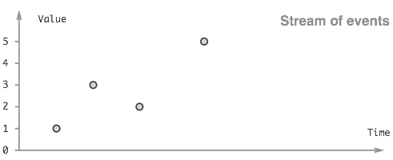
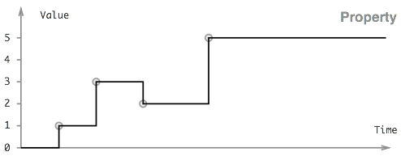

In Bacon.js we operate with two different types of observable data types: **Event Streams** and **Properties**. Here's a brief explanation
of what these concepts are along with some concrete examples to illustrate when to choose one over the other.

## Event streams represent discrete values over time

You can think of event streams as lists of events happening over time.

```txt
[(t1, v1), (t2, v2), ..., (tn, vn), ...]
```



Examples of event streams are:

- Mouse clicks on a button:

```js
const clickStream = Bacon.fromEvent(document.querySelector("#button"), "click");
```

- Keystrokes on an input field:

```js
const keyStream = Bacon.fromEvent(document.querySelector("#input"), "keyup");
```

- A promise that resolves after hitting an API and coming back with data:

```js
const ajaxCall = axios.get("//your.api.com/endpoint");
const dataStream = Bacon.fromPromise(ajaxCall);
```

Note that for these examples, talking about an initial value wouldn't make any sense. Also, these streams will only happen to have a value
(ie: event) pushed down the stream when the user either clicks on the button or presses a key on the input field, or when we hear back from
the API. Remember that clicking on the button means pushing that click event onto the stream: **our value is the click event itself**.

## Properties introduce the notion of continuous values

Properties represent values that change over time. The value of a property changes in response to events, which means that any stream may be
easily converted into a property.



In most ways properties behave very much like event streams. The main differences between the two are:

- Properties can have an **initial value**. They don't always do, though: depending on how a property is created, it may or may not have
  one.
- Properties remember or hold the last value they've received. This means **properties are continuous**, as opposed to event streams which
  are discrete. The only exception to this rule is when a property doesn't get assigned an initial value when it gets created.
- The current value stays as its last value **even after the stream has ended**.

Examples of properties are:

- The position of our mouse cursor determined by any series of movements:

```js
const mouseProperty = Bacon.fromEvent(document, "mousemove")
	.map((event) => `(${event.x}, ${event.y})`)
	.toProperty();
```

- The value of an input field at any given time:

```js
const inputProperty = Bacon.fromEvent(document.querySelector("#input"), "keyup")
	.map(".currentTarget.value")
	.toProperty("This is the default value");
```

## The Observable interface

Both streams and properties implement the `Observable` interface, meaning they share a lot of methods: `onValue`, `onError`, `fromPromise`,
`map`, among many others. Check out the full list of shared methods
[here](http://baconjs.github.io/api.html#common-methods-in-eventstreams-and-properties).

These methods typically return another observable to allow for further chaining. Of course, there are exceptions (such as `onValue`).

## Assigning values to DOM elements (or how to purposely create side effects)

This concept of "current value" makes properties great for assigning values and attributes to DOM elements. Bacon provides a helper method
for assigning the value of a property to a DOM node:

```js
property.assign(nodeElement, setterMethod [, ...args])
```

This calls the method `setterMethod` of the given `nodeElement` whenever the value of the property changes (**even for the initial
value!**). You can optionally provide arguments which will get passed in onto the setter method.

So, if you want to hide or show a button based on the value of a property, you could do something along the lines of:

```js
buttonVisibilityProperty.assign($("#my-button"), "toggle");
```

Here the value of the property gets automagically passed in onto `toggle()`. Also, we assume we are dealing with a boolean property here.

Now, chances are most of us aren't using jQuery in our projects. How can we make `assign()` work with our vanilla JS DOM manipulation
skills?

DOM nodes, when not wrapped in the `jQuery` object, don't have setter methods like `attr()`, `html()` or `text()`. That's why `assign` isn't
quite the best option out there if we don't use `jQuery`.

Probably an example will help see this better: let's say we extend our `HTMLInputElement` prototype, which is sort of what jQuery does
(**this is bad though! don't do it**, my intent is just to showcase why we can't usually resort to `assign()` for updating the DOM without
jQuery):

```js
HTMLInputElement.prototype.setValue = function (message, value) {
	this.value = value;
	console.log("clicked", message);
};

Bacon.fromEvent(document.querySelector("#button"), "click")
	.map(1)
	.scan(0, (accumulator, value) => accumulator + value)
	.assign(document.querySelector("#input"), "setValue", "rawr");
```

We can even pass in a third argument. If we do, those arguments we pass in are gonna come first than the property value. See how on the
prototype method `message` comes before the actual value? So, what do we do if we want to mutate the DOM state based on the value of a
property but can't use `assign()`? Well, `assign` is nothing more than a fancy version of `onValue()`. We could do the following:

```js
const button = document.querySelector("#button");
const input = document.querySelector("#input");

Bacon.fromEvent(button, "click")
	.map(1)
	.scan(0, (accumulator, value) => accumulator + value)
	.onValue((count) => (input.value = count));
```

Note we can use `assign()` only with properties, but we can use `onValue()` in this way with event streams as well.

## Creating properties from event streams

There are a couple methods you can use to turn your event stream into a property:

- `stream.toProperty(initialValue)` creates a property based on the event stream. Passing in an initial value is optional. If we don't
  provide one, the property will get its first value from the stream, and will always hold a value thereafter. Here's a super simple
  example that logs out the current timestamp for every click on a button:

```js
const counter = Bacon.fromEvent(document.querySelector("#button"), "click")
	.map(() => Date.now())
	.toProperty("initial value")
	.onValue((value) => {
		console.log(value);
	});
```

Just out of curiosity, have a go at what happens if you replace `() => Date.now()` within `map()` with just `Date.now()`.

- We can also `scan()` and `fold()` event streams to convert them into properties. These are similar to `reduce()` in functional
  programming — think of `Array.prototype.reduce()`. An example of `scan()` is the counter we built before when we went through how
  `assign()` works.

Note that `fold()` is a little bit different from `scan()`. Consider this example:

```js
Bacon.fromArray([1, 2, 3, 4])
	.scan(0, (accumulator, value) => accumulator + value)
	.onValue((value) => {
		console.log(value);
	});
```

We will get all intermediate values logged out to the console: 0, 1, 3, 6 and 10. That is, the property updates for every single
calculation.

```js
Bacon.fromArray([1, 2, 3, 4])
	.fold(0, (accumulator, value) => accumulator + value)
	.onValue((value) => {
		console.log(value);
	});
```

`fold()`, on the other hand, will only emit a value and log to the console after going through all of the elements in the array (ie: will
only log out the final value to the console, which is 10).

One more thing: `reduce()` and `fold()` are aliases.

## Adding an initial value after a property has been created

`property.startWith(value)` allows you to add an initial value to a property later in time. If the property has already an initial value of
its own, it will be overwritten.

This is particularly useful when you receive a property from somewhere else and you have no control over how that property gets created. You
can then add an initial value before subscribing to it.

## Going the other way around: creating event streams from properties

When you have a property, you might want to turn it back into an event stream. Again, there are a couple ways to achieve this:

- Probably the easiest way is to use the `changes()` method, which creates an event stream that emits every time the value of our property
  changes. The only gotcha here is that this doesn't include the initial value of the property.
- Bacon offers another method called `toEventStream()` which behaves in exactly the same way than `changes()`, except that it includes the
  property's initial value.
- Another option is polling the property at fixed intervals by using `sample(interval)`. This basically creates an event stream that emits
  the value of the property at every given interval.
- There's yet another alternative, which involves using the `sampledBy(EventStream)` method. What this one does is sample the property
  every time the event stream passed in as an argument emits a value.

## Subscribing to properties

The process of subscribing to both types of observables is the same: you call the `onValue()` method and pass in a callback function. But
when you subscribe to a property which has a current value, **the callback will be executed immediately (synchronously) with the current
value of the property**.

```js
const property = Bacon.fromEvent(document.querySelector("#button"), "click")
	.map("clicked")
	.toProperty("this is the initial value")
	.onValue((value) => {
		console.log(value);
	});
```

This example will log "this is the initial value" before you first click on the button.

Just out of curiosity (again), have a look at what would happen if you map the stream value right after turning it into a property — in
other words, just call `toProperty()` before `map()`.
