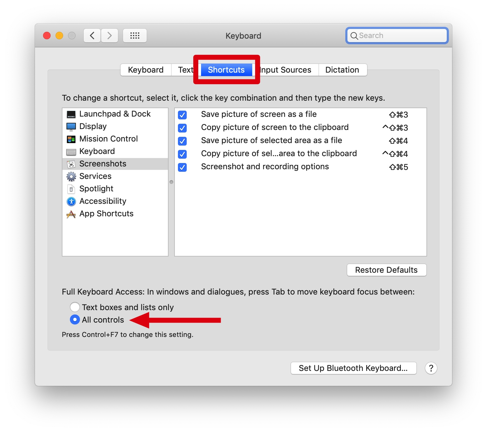
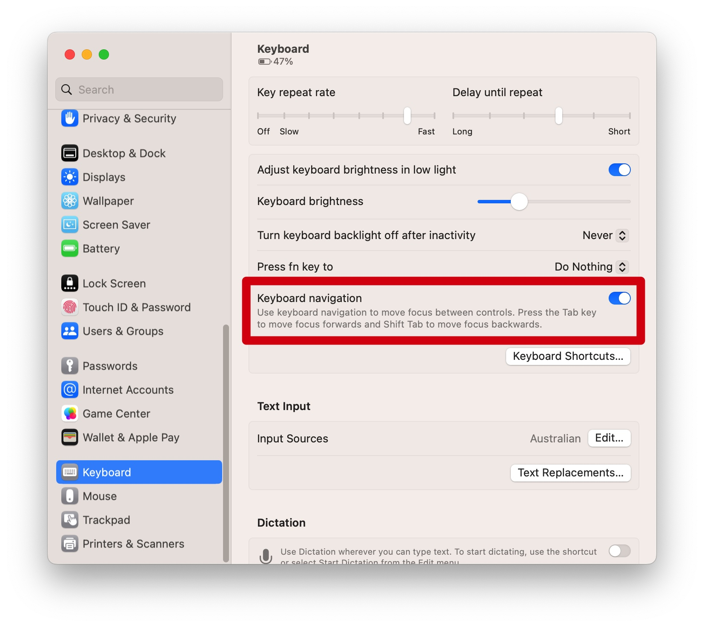
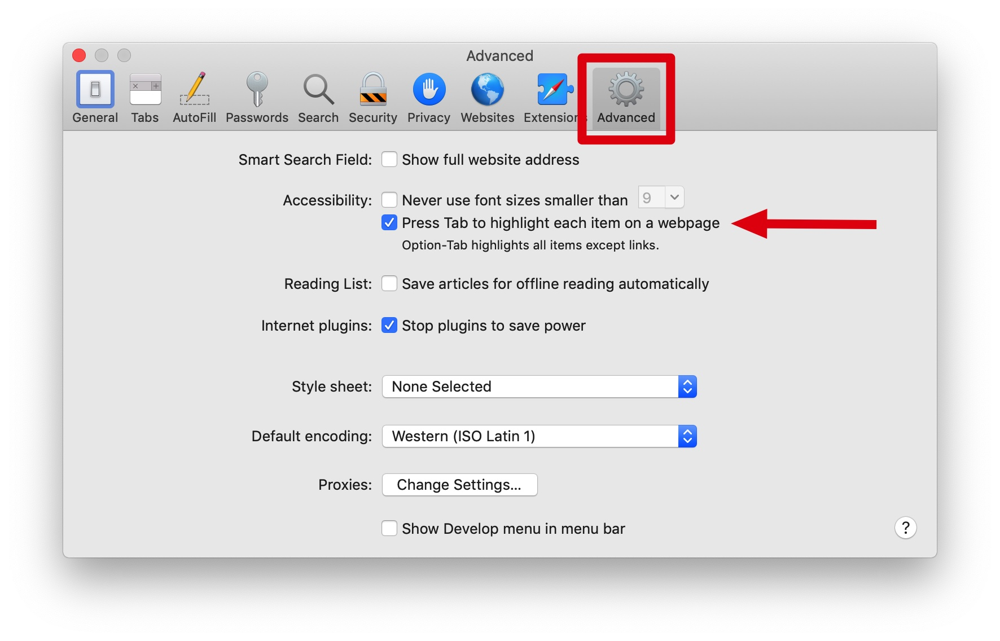
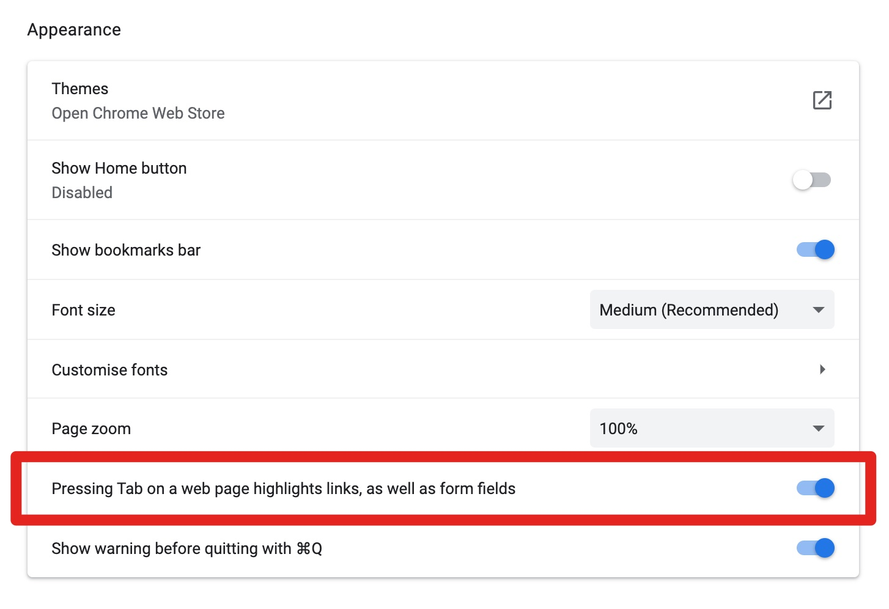

If you've ever used your keyboard to navigate a page in MacOS, you might have noticed you cannot tab through all tabbable elements on the
page. Some are fine, such as buttons and input fields, but others (e.g. links) are not reachable using your keyboard.

The worst part is that this is not obvious, and there's no way for developers to enforce this setting on their sites.

## Fixing Firefox

By default, there's a global system setting to modify this behaviour that you can toggle by going to _System Preferences > Keyboard >
Shortcuts_ and then clicking on the **All Controls** radio button, which is at the bottom of the screen in the _Full Keyboard Access_
section.

Doing this should automatically fix Firefox, which is true to the system settings.

Firefox does not have a separate option for tab key navigation to links and form controls. In Firefox the OS X system preference takes
precedence.

**Update:** The UI has changed a little bit in the last couple versions of MacOS. For MacOS Ventura, the option we need to enable is under
_System Preferences > Keyboard_ and is now a toggle element called "Keyboard navigation".

## Fixing Safari

Safari, on the other hand, has its own setting. By default pressing the _Tab_ key would allow you to highlight all focusable elements on the
page except for links.

To change this behaviour, go to _Safari > Preferences_, click on the _Advanced_ tab and finally click on the **Press Tab to highlight each
item on a webpage** checkbox. By toggling this flag, we can now focus on all elements on the page, including links.

Note that this works for both [Safari](https://www.apple.com/safari/) and
[Safari Technology Preview](https://developer.apple.com/safari/technology-preview/) and needs to be done separately on both versions of the
browser.

## Chrome should work fine out of the box

Chrome also has a setting for this under [chrome://settings/appearance](chrome://settings/appearance). This setting is enabled by default,
though. So there's no need to configure anything to make Chrome work.

