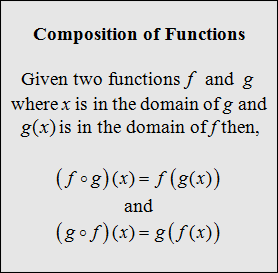
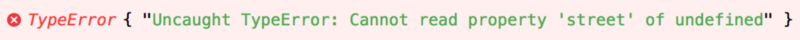

Just wanted to list a handful of rather unusual yet interesting use cases for `Array#reduce`, as most of the examples out there involve
adding numbers together, something along the lines of:

```js
const numbers = [1, 2, 3, 4, 5];
const sum = numbers.reduce((acc, current) => acc + current, 0);
```

But there's much more to `Array.prototype.reduce` than summing numbers in a list.

_Heads up: Note that this post is not JavaScript specific as these concepts apply to any language supporting reducing arrays._

## Functional pipelines (aka: function composition)

We can use `Array#reduce` to compose functions. Just to recap, here's what composing functions means in Maths:



The same concept applies to programming: we can apply different functions to a value one after the other and get a result out of that
composition.

Here's how we can compose functions using `Array#reduce`:

```js
const double = (value) => 2 * value;
const triple = (value) => 3 * value;
const half = (value) => 0.5 * value;
const square = (value) => value * value;
const pipeline = [square, double, triple, half];
const initialValue = 5;
const finalValue = pipeline.reduce((accumulator, fn) => fn(accumulator), initialValue);
```

In this example, our pipeline determines the order of application for the functions because we are iterating over the pipeline array:

```js
half(triple(double(square(x))));
```

which for the initial value of `5` results in:

```js
half(triple(double(square(5)))) = 75;
```

This is similar to Bash's pipes, which let you use the output of a program as the input of another one.

In this sample script, we first list all of the files in the current directory, then filter out anything that is not a json file and finally
delete the selected files:

```sh
ls | grep "\.json$" | xargs rm -f
```

We can rewrite this to use the same function composition notation as before:

```js
rm(grep(ls));
```

## Recursively flatten arrays

We can use `Array.prototype.reduce` to recursively flatten an array:

```js
function flatten(arr) {
	return arr.reduce((acc, current) => {
		if (Array.isArray(current)) {
			return acc.concat(flatten(current));
		}

		return acc.concat(current);
	}, []);
}
```

Note how we boil down the argument to a new array, starting from an empty list and concatenating new values as we move forward.

This works even for really deep nested arrays like:

```js
flatten([1, 2, [3, 5, [6, 5, 4, [7, 8, [9]]], 1]);
```

## Re-implementing Lodash's `get` method

Let's consider this example:

```js
const person = {
	name: "John Doe"
};
const address = person.address.street;
```

This is obviously gonna throw a `TypeError` exception as we are trying to access a property of undefined, which is not an object.



We use [Lodash's get helper](https://lodash.com/docs/#get) when querying an object for properties we are not sure exist. We can easily
re-implement this helper using `Array#reduce`:

```js
function get(obj, path, defaultValue) {
	return path.split(".").reduce((acc, field) => {
		if (acc[field]) {
			return acc[field];
		}

		return defaultValue;
	}, obj);
}
```

Let's now use it:

```js
const person = {
	details: {
		name: {
			first: "John",
			last: "Doe"
		},
		email: "john@doe.com",
		dob: {
			day: 15,
			month: "January",
			year: 2017
		}
	}
};
const day = get(person, "details.dob.month.number", "bummer");
const month = get(person, "details.dob.day");
const year = get(person, "details.dob.year");

console.log("dob is", `${month} ${day}, ${year}`);
console.log("age is", get(person, "details.age", "/shrug"));
```

Side note: for the first example, we might as well play safe by doing:

```js
const address = person.address && person.address.street;
```

However I find using `get(person, 'address.street')` to be much more concise. But it's just interesting to see how we'd go about
reimplementing the utility library by using reduce.

## Optimising chained operations for better performance

It's a common practice to chain multiple `map`, `filter` and `reduce` calls to the same array:

```js
const numbers = [10, 5, 11, 20, 14, 15, 2, 3];
const result = numbers.filter((current) => current % 2 === 0).map((current) => 3 * current);
```

This is great in terms of readability as the intent of our code is super clear and easy to follow. However, bear in mind each time we chain
one of these functions, not only we are creating a new array in memory on the process but we are also iterating again over the resulting
list. This can have significant performance implications if we are dealing with massive collections.

For the example above, we can easily achieve the same result with a single call to `Array#reduce` by encapsulating the logic of the `filter`
and `map`:

```js
const result = numbers.reduce((acc, current) => {
	if (current % 2 === 0) {
		acc.push(3 * current);
	}

	return acc;
}, []);
```

This way we are only looping over the initial array once and no extra arrays are created in the process. Again, not a huge performance gain
in this case with just one map and one filter, but could be quite significant if there are more operations chained and the initial
collection is bigger.

## Counting occurrences

For any list of recurring values, we can use `Array.prototype.reduce` to count how many times each value is present on our list.

```js
const countries = ["AU", "NZ", "AU", "UK", "IE", "IT", "IE", "NZ", "CH", "UK", "IT", "AU", "NZ", "AU", "IT"];
const count = countries.reduce((acc, val) => {
	if (acc[val]) {
		acc[val] = acc[val] + 1;
	} else {
		acc[val] = 1;
	}

	return acc;
}, {});
```

In this case, we return an object in which keys are distinct countries and values are the number of occurrences for each country:

```js
{
  AU: 4,
  CH: 1,
  IE: 2,
  IT: 3,
  NZ: 3,
  UK: 2
}
```

## Adding multiple new nodes to the DOM

Consider the following code:

```js
nodes.forEach((node) => document.body.append(node));
```

DOM injections and modifications are expensive, so it's important to keep these interactions to a minimum. Using fragments keeps
recalculation of styles, painting and layout to a minimum. In this case, we could make use of `DocumentFragment` which acts as a pseudo DOM
node and allows us to do exactly the same thing but in a more performant way:

```js
const nodesInFragment = nodes.reduce((fragment, node) => {
	fragment.append(node);
	return fragment;
}, document.createDocumentFragment());

document.body.append(nodesInFragment);
```

I've seen some of these ideas on [Mykola Bilokonsky's Egghead course](https://egghead.io/courses/reduce-data-with-javascript) and also on
[Twitter](https://twitter.com/argyleink/status/1169833100483809280).
