Being able to easily transform the values in observables is what makes functional reactive programming such a powerful tool. At the same
time, one of the main goals of libraries such as [Bacon.js](http://baconjs.github.io/) and [RxJS](http://reactivex.io/rxjs/) is to **provide
a unified programming model to handle any type of data, whether it's synchronous (an array) or asynchronous (an event stream)**.

These libraries make use of a simple, familiar API based on the functional programming extensions added to JavaScript arrays (known as the
`Array#extras`). You are probably already familiar with the `Array.prototype.map`, `Array.prototype.filter` and `Array.prototype.reduce`
methods JavaScript provides. `map`, `filter` and `reduce` work in pretty much the same way on observables as they do on collections.

## Immutability

This is also where immutability comes into play. When mapping or filtering an instance of `Observable` you will get a whole new `Observable`
instead of modifying the source one. This holds true for all the combinators in Bacon.js as well. In most cases, **the new `Observable` will
emit the transformed value whenever the source one emits a value**.

## Map

It's likely you've used
[`Array.prototype.map()`](https://developer.mozilla.org/en-US/docs/Web/JavaScript/Reference/Global_Objects/Array/map) at some point, here's
a quick example that maps all values in our array to their double:

```js
const numbers = [1, 2, 3];
const doubles = numbers.map((number) => 2 * number);
```

Here, `map` receives a callback we call the **transform function**.

`observable.map(f)` works in exactly the same way: it maps all values that get pushed to our event stream using a transform function, and
**returns a new observable** (immutability, remember?).

So, this would be kind of the same example but using event streams (where values get pushed asynchronously down the stream) instead of
arrays (where values start off being in memory and the mapping happens in a synchronous way):

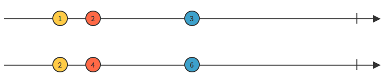

```js
const numbersStream = Bacon.sequentially(300, [1, 2, 3]);
const doublesStream = numbersStream.map((value) => 2 * value);
```

Note that the resulting stream will end as soon as the source stream ends.

There are some neat built-in features around `observable.map`:

- Instead of a transform function, you can also pass in a constant value:

```js
const ones = clicks.map(1);
```

This means every value that gets pushed down the stream will be mapped to a constant, in this case, the number 1.

- You can also use a "property extractor string" like `.keyCode`. This way, if the argument `map` receives is a string starting with a
  dot, the elements will be mapped to the corresponding field/function in the event value. For instance: `map('.keyCode')` will pluck the
  `keyCode` field from the event value. If `keyCode` was a function, the result stream would contain the values returned by the function.

## Filter

`observable.filter(f)` filters out values using the given **predicate function**, just like
[`Array.prototype.filter`](https://developer.mozilla.org/en-US/docs/Web/JavaScript/Reference/Global_Objects/Array/filter). This basically
means we use the function passed in to determine whether the value should be emitted or skipped entirely:

- if `f(value)` evaluates to `true` (or any truthy value), then `value` is emitted.
- if `f(value)` evaluates to `false` (or any falsey value), then that particular value is skipped (meaning it doesn't get pushed down the
  stream).

The resulting stream will end along with the source stream.

In this example, we are only emitting those values greater than 20:

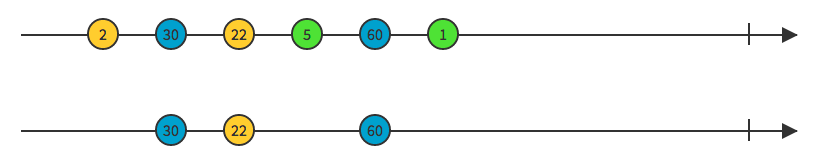

```js
const numbersStream = Bacon.sequentially(300, [2, 30, 22, 5, 60, 1]);
const filteredStream = numbersStream.filter((value) => value > 20).log("filteredStream");
```

Note that, contrary to what happens with `map`, the filtered stream does not emit a value each time the source emits a value — after all
that's the whole point of using filters.

Instead of passing in a function, you can also provide:

- **a constant value:** `true` will include/emit all values, `false` will exclude/skip all of them (might be useful if you pass in a
  boolean variable, think of it as a switch):

```js
observable.filter(false);
```

- **a property extractor string:** let's say you have a boolean property you'd like to filter by, say `isAvailable`. In order to get only
  the available values, we just need to do:

```js
productsStream.filter(".isAvailable");
```

- **an instance of `Property`:** we can also pass in a property to filter out the values of the event stream based on the current value of
  the property. The stream will emit the value only if the property is truthy when the value gets pushed down the stream.

## Fold or Reduce

Reducing roughly means deriving a value from all of the values in a list or collection. At the core of it, we get a single, computed value
out of a bunch of other values.

Here's an example of how
[`Array.prototype.reduce`](https://developer.mozilla.org/en/docs/Web/JavaScript/Reference/Global_Objects/Array/reduce) works:

```js
const numbers = [1, 2, 3, 4, 5];
const sum = numbers.reduce((accumulator, value) => accumulator + value, 0);
```

Reduce works in exactly the same way with asynchronous values (ie: with event streams). We need to pass in:

- Initial value (also called the **seed** value)
- Accumulator function which takes an accumulator as the first argument and the current value as the second argument.

By the way, `fold` and `reduce` are aliases. You can use them interchangeably.

In this example we sum all of the numbers in the source stream. The resulting stream emits the result of the sum **once the source stream is
done emitting values**.

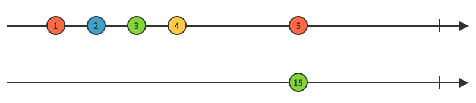

```js
const numbersStream = Bacon.sequentially(300, [1, 2, 3, 4, 5]);
const foldStream = numbersStream.fold(0, (accumulator, value) => accumulator + value).log("foldStream");
```

The resulting stream **will emit only once** after the source stream has ended, and it will also end afterwards.

Note that fold or reduce **always return an instance of `Property`**.

## Scan

`observable.scan(seed, f)` works pretty much in the same way `fold` does, but for the number of values pushed down the resulting property.
**`scan` emits a value every single time a value is emitted by the source stream.**

Once the last value gets pushed down the resulting property, it ends. This happens simultaneously with the termination of the source stream.

Here's kind of the same example we used for `fold`. The only difference is the resulting stream here **will emit on each and every partial
result** — that is, whenever the accumulator function runs.

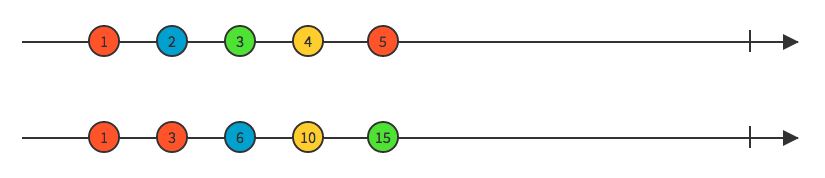

```js
const numbersStream = Bacon.sequentially(300, [1, 2, 3, 4, 5]);
const scanStream = numbersStream.scan(0, (accumulator, value) => accumulator + value).log("scanStream");
```

Note that `scan` also returns an instance of `Property`.

## Take

`observable.take(n)` takes the **first `n` values** from the source stream. Once the first `n` values have been emitted, the stream ends.

Two common edge cases are:

- If the source stream emits less than `n` values, both streams will emit the same number of values and end at the same time.
- If `n <= 0` this is equivalent to `Bacon.never()`, that is, it will immediately end.

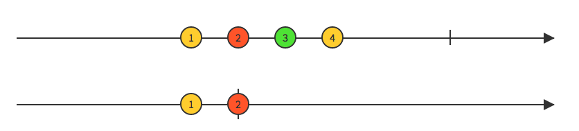

```js
const numbersStream = Bacon.sequentially(300, [1, 2, 3, 4]);

// This will emit the first two values and end
const takeStream = numbersStream.take(2).log("takeStream");

// This will immediately end
const takeNoneStream = numbersStream
	.take(0) // might as well be a negative number
	.log("takeNone");

// This will emit the first 4 values of the source stream and end
const takeMoreThanFourStream = numbersStream.take(20).log("takeMoreThanFourStream");
```

Side note re: `filter` vs `take`. If we were working with arrays, we could easily accomplish what take does by doing:

```js
const numbers = [1, 2, 3, 4];
const takeFirstThree = numbers.filter((value, index) => index <= 2);
```

The key here is the `index` argument which gets automatically passed in to the predicate function. This is not the case with the bacon-y
version of `filter`. Since no `index` gets passed in (events occur in an async fashion), we need this resort to the `take` operator to
achieve this.

## Skip

`observable.skip(n)` skips the first `n` values from the stream, and emits all values thereafter. It will end once the source stream ends.

Again, we've got a couple of edge cases here:

- If `n` is greater than the number of events the source stream emits before ending, then the resulting stream will end **but only after
  all events in the source stream have been emitted**.
- If `n <= 0` it will emit all of the values in the source stream and then end, that is, it has no effect whatsoever.

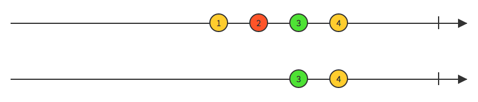

```js
const numbersStream = Bacon.sequentially(100, [1, 2, 3, 4]);

// This will skip the first two values and then end
const skipStream = numbersStream.skip(2).log("skipStream");

const skipNone = numbersStream
	.skip(0) // might as well be a negative number
	.log("skipNoneStream");

// Will end but not immediately,
// rather after the source stream has emitted all of its four values
const skipMoreThanFourStream = numbersStream.skip(20).log("skipMoreThanFourStream");
```

## First

`observable.first()` emits only the very first value in the source stream. This is essentially the same as `observable.take(1)`.

If the source stream ends without emitting a value, the new stream will immediately end, being equivalent to `Bacon.never()`.

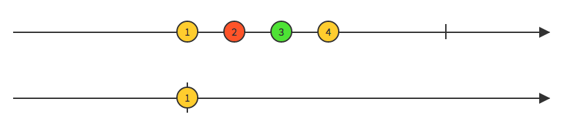

```js
const numbersStream = Bacon.sequentially(100, [1, 2, 3, 4]);
const firstValueStream = Bacon.first().log("firstValueStream");
```

## Last

`observable.last()` emits only the last value from the source stream and then ends.

If the source stream is empty and immediately ends, the resulting stream will be immediately terminated as well.

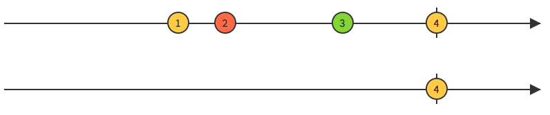

```js
const numbersStream = Bacon.sequentially(100, [1, 2, 3, 4]);
const lastValueStream = Bacon.last().log("lastValueStream");
```

## Take While

`observable.takeWhile(f)` emits all values as long as the **predicate function** `f` applied to the current event returns `true` (or a
truthy value). The stream will terminate (stop emitting) as soon as the predicate function evaluates to false (or, you guessed it, any
falsey value).

If no predicate function is provided, the identity function will be used, ie: `(x) => x`.

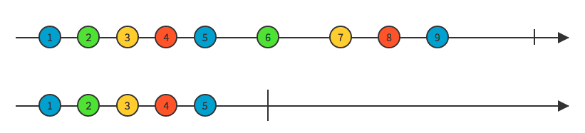

```js
const numbersStream = Bacon.sequentially(300, [1, 2, 3, 4, 5, 6, 7, 8, 9]);
const takeWhileStream = numbersStream.takeWhile((value) => value * value < 30).log("takeWhileStream");
```

## Take Until

`observable.takeUntil(otherStream)` takes elements from the source event stream until an event (any event) gets pushed down the stream
passed in as a param, and then ends.

If `otherStream` ends without emitting any values, it is ignored (that is, all values in the source stream gets emitted in the result stream
as well, meaning the operator has no effect at all).

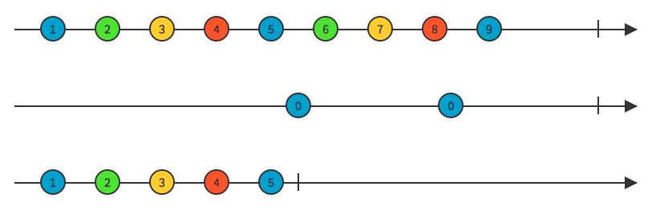

In this code example below the result stream will emit all first five values — this is because the second stream gets its first value
emitted 1.5 secs after being subscribed to, while the source stream is capable of emitting five values in that period as it emits every 300
milliseconds.

```js
const numbersStream = Bacon.sequentially(300, [1, 2, 3, 4, 5, 6, 7, 8, 9]);
const zerosStream = Bacon.sequentially(1500, [0, 0]);

// Take values from the numbers stream until
// an event gets pushed down the zeros stream
const takeUntilStream = numbersStream.takeUntil(zerosStream).log("takeUntilStream");

// Bacon.never() emits no values.
// However, takeUntilNever emits all values in the source stream
const takeUntilNeverStream = numbersStream.takeUntil(Bacon.never()).log("takeUntilNeverStream");
```

## Delay

`observable.delay(wait)` will return an event stream that emits all values in the source stream but after `wait` milliseconds. Note that
**we are not delaying every single value**, rather this is a pause before the resulting stream starts emitting.

If the provided delay is zero or a negative value, the resulting stream will emit at the same rate the source stream does.

One more thing. Note that this operator **will not delay the initial value of a property**. This means, if you `delay` a property, you will
get the initial value emitted immediately, and all subsequent values emitted appropriately after wait milliseconds.

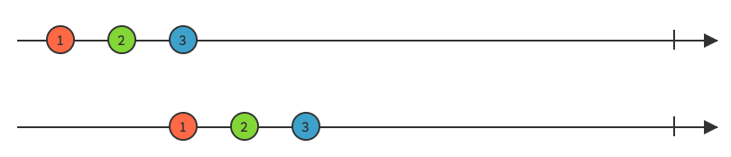

```js
const numbersStream = Bacon.sequentially(300, [1, 2, 3]);
const delayStream = numbersStream.delay(900).log("delayStream");
const noDelayStream = numbersStream
	.delay(0) // could also be a negative number
	.log("noDelayStream");
```

## Debounce

Debouncing is not a Bacon specific concept. You've probably come across [Lodash's debounce](https://lodash.com/docs/#debounce) before. The
debounce technique allows us to group a sudden burst of sequential events (keystrokes, for instance) into a single one. It basically
**limits the rate at which a function or event can fire**. Here's an
[interesting article on debouncing](https://css-tricks.com/debouncing-throttling-explained-examples/) with some useful examples.

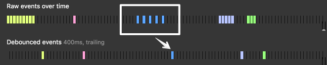

In the same way, what `observable.debounce(delay)` does is to delay emitting a value in the resulting stream until after `delay`
milliseconds have elapsed **since the last time the source stream has emitted**. That is, it creates a new debounced version of the original
observable which will emit a value only after a `delay` milliseconds period of no events.

Which event gets emitted after that sec? The **last one**.

Consider this example in which we've got a button you can click as many consecutive times as you want. Every time you click on the button,
an event will get pushed down `clicksStream`. However, we derive a new `debouncedStream` from this one that **emits only a second after the
last time you've clicked on the button, provided it has remained unclicked for that whole second**.

```js
const button = document.getElementById("btn");
const clicksStream = Bacon.fromEvent(button, "click").map("This is a click event");
const debouncedStream = clicksStream.debounce(1000).log("debouncedStream");
```

This marble diagram might help visualise the whole idea behind debounce:

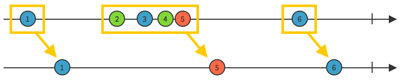

Debounce is particularly useful for implementing behaviour that should only happen after the input has stopped arriving. Probably the most
traditional example is building a typeahead search component that triggers an API call whenever we type on an text input field. However, we
don't want to hit the API on every keystroke as that'd be expensive in terms of performance. What we do instead is to wait until the user
has finished typing.

```js
const inputStream = Bacon.fromEvent(document.querySelector("#input"), "keydown")
	.debounce(300) // limit the rate of queries
	.map((event) => event.target.value); // get text value from event
```

In this example what we do is to wait until there has been no further input for the last 300 ms. — we assume the user has then finished
typing, and we fire the Ajax call.

## Debounce Immediate

Debounce implementations such as Lodash's one take an optional argument called `leading` — although here in Baconland we call it
`immediate`.

An immediate debounce fires the event on the **leading edge** (the very beginning of the wait interval) instead of the **trailing edge**
(the end of the wait interval). This is useful in circumstances like preventing accidental double-clicks on a submit button from firing a
second time.

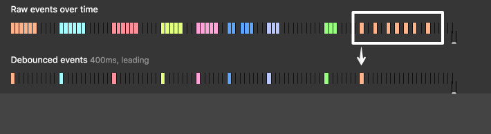

## Throttle

`observable.throttle(delay)` returns a new throttled version of the original observable, which will emit values **at most once every `delay`
milliseconds only**. By using throttle we prevent our stream from firing events more than once in that wait period. Here's a
[great way to visualise how debounce and throttle work](http://demo.nimius.net/debounce_throttle/).

A traditional example is **infinite scrolling**: you need to check how far the user is from the bottom of the page, because if they are
close to the end (whatever we decide _close_ is) we need to request more content via Ajax and append it to the page. `debounce` wouldn't be
of much help here as it'd only trigger when the user stops scrolling. `throttle`, on the other hand, will work a charm in this case.

## Not

`observable.not()` will result in a new stream where all values are inverted, that is, all truthy values will be mapped to `false`, whereas
all falsey values will be mapped to `true`.

The resulting stream will end simultaneously with the source stream.

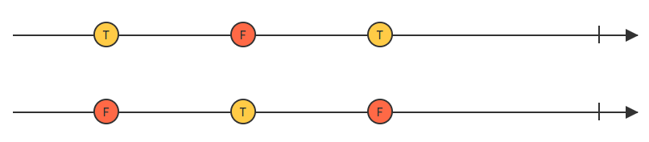

```js
const booleansStream = Bacon.sequentially(300, [true, false, true]);
const invertedBooleansStream = booleansStream.not().log("invertedBooleansStream");
```

The `not` operator will work just fine even if the values on the source stream are not booleans:

```js
const booleansStream = Bacon.sequentially(300, ["bacon", 1, 0, null, "", {}, []]);
```

The example above returns `false, false, true, true, true, false, false`.

Note that using the `.not()` operator is equivalent to using the `map` operator in this way: `.map((value) => !value))`.

## Making infinite streams end

Some of these operators (`take`, `skip`, `first`, `last`, `takeWhile`, `takeUntil`) have the ability to turn an infinite stream into a
finite one. This means that the resulting stream will end at some point, ie: will emit a complete signal.

## Visualisation tools

Here's a couple of neat tools that will help you visualise many of the different ways to manipulate and combine streams. Even though most of
these are RxJS specific, concepts behind operators are certainly similar between libraries.

- [Bacon.js Examples](http://baconjs-examples.blakehaswell.com/)
- [RxMarbles](http://rxmarbles.com/)
- [reactive.how](https://reactive.how/)
- [Rx Visualizer](https://rxviz.com/)
