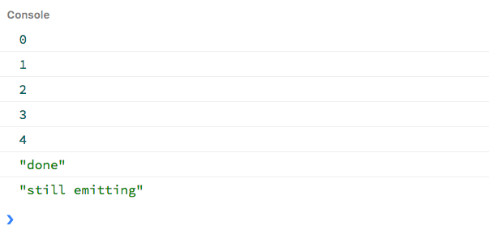

Let's write our own `Observable` interface implementation to understand what's going on under the hood when we work with RxJS.

**An observable is just a function.** This function takes in an observer as an argument, and returns a subscription object.

- An _observer_ is just an object with three methods: `next` which takes in a value, `error` which takes in an error message and
  `complete` with has no arguments. This is what a standard (logging) observer looks like:

```js
{
    next(value) {
        console.log(value);
    }, error(err) {
        console.error(err);
    }, complete() {
        console.info('done');
    }
}
```

- A _subscription_ object represents a disposable resource, such as the execution of an Observable. This subscription has a bunch of
  methods such as `add` and `remove`, but the most important one is `unsubscribe` which takes no argument and just disposes the resource
  held by the subscription. More on this later, when we get to the asynchronous examples.

When an Observable _produces_ a value, it lets the observer know by calling `next` on the produced value, or `error` when a problem occurs.

This communication between the observable and the observer can terminate in two different ways:

- the observer (_consumer_ of values) decides it's no longer interested in receiving more values and it therefore unsubscribes from the
  observable by calling the `unsubscribe` function returned upon subscription.
- the observable (_producer_ of values) has no more values to send, and informs the observer by calling `complete` on it.

## A synchronous `Observable` example: `Rx.Observable.from`

Let's try to recreate the following behaviour provided out of the box by RxJS. We'll create an observable that returns _synchronously_ and
_immediately_ five values over time, and then completes.

```js
const numbers$ = Rx.Observable.from([0, 1, 2, 3, 4]);

numbers$.subscribe(
	(value) => console.log(value),
	(err) => console.error(err),
	() => console.info("done")
);
```

Based on our previous definition of observable, we can rewrite our `numbers$` stream from the ground up by using a function which takes an
observer object as an argument, like this:

```js
function Observable(subscribe) {
	this.subscribe = subscribe;
}

Observable.from = (values) => {
	return new Observable((observer) => {
		values.forEach((value) => observer.next(value));
		observer.complete();
		return {
			unsubscribe() {
				console.log("unsubscribed");
			}
		};
	});
};

const observer = {
	next(value) {
		console.log(value);
	},
	error(err) {
		console.error(err);
	},
	complete() {
		console.info("done");
	}
};

const numbers$ = Observable.from([0, 1, 2, 3, 4]);
const subscription = numbers$.subscribe(observer);

setTimeout(subscription.unsubscribe, 500);
```

The `forEach` statement is in charge of delivering our values synchronously. Immediately afterwards, we call the `complete` method to notify
the observer we are done producing values.

By and large, what's going on here is the observable notifies the observer of all emitted values and right after the last value got pushed
through, it lets the observer now it's done emitting.

_Side note:_ here unsubscribing doesn't make much sense as values get delivered in a synchronous fashion. Just wanted to illustrate how a
subscription object gets returned, and how we can unsubscribe at some point later in time.

## A flaw in our implementation

Even though our implementation works, there's an edge case we haven't accounted for: we _can_ keep emitting values even after having called
`complete`. Try this:

```js
Observable.from = (values) => {
	return new Observable((observer) => {
		values.forEach((value) => observer.next(value));
		observer.complete();
		observer.next("still emitting");

		return {
			unsubscribe() {
				console.log("unsubscribed");
			}
		};
	});
};
```

The observer will get notified of this last `still emitting` value, even though the observable has already told the observer it was done
emitting values.



Let's tweak our implementation so that it stops emitting once unsubscribed from. For starters, we'll create some sort of observer wrapper
with some basic validation logic, which also keeps track of whether it has already unsubscribed from the observable (this would be the
observer _state_).

```js
class Observer {
	constructor(handlers) {
		this.handlers = handlers; // next, error and complete logic
		this.isUnsubscribed = false;
	}

	next(value) {
		if (this.handlers.next && !this.isUnsubscribed) {
			this.handlers.next(value);
		}
	}

	error(error) {
		if (!this.isUnsubscribed) {
			if (this.handlers.error) {
				this.handlers.error(error);
			}

			this.unsubscribe();
		}
	}

	complete() {
		if (!this.isUnsubscribed) {
			if (this.handlers.complete) {
				this.handlers.complete();
			}

			this.unsubscribe();
		}
	}

	unsubscribe() {
		this.isUnsubscribed = true;

		if (this._unsubscribe) {
			this._unsubscribe();
		}
	}
}
```

One thing I'd like to highlight here is how we unsubscribe once either `complete` or `error` get called. This means not only we've fixed our
implementation flaw, but we're also now unsubscribing when an error gets thrown.
[More on this here](https://github.com/Reactive-Extensions/RxJS/tree/master/doc/designguidelines#32-assume-resources-are-cleaned-up-after-an-onerror-or-oncompleted-message).

We also need to adjust our `Observable` function to make it work with this new `Observer` implementation.

```js
class Observable {
	constructor(subscribe) {
		this._subscribe = subscribe;
	}

	subscribe(obs) {
		const observer = new Observer(obs);

		observer._unsubscribe = this._subscribe(observer);

		return {
			unsubscribe() {
				observer.unsubscribe();
			}
		};
	}
}
```

_Side note:_ see how we are returning a subscription object after we subscribe? That's the reason why we can't keep on chaining operators
after we call `subscribe` on a stream.

So, now that we've got our `Observable` and `Observer` helper classes, let's rewrite our example to make use of them:

```js
Observable.from = (values) => {
	return new Observable((observer) => {
		values.forEach((value) => observer.next(value));
		observer.complete();

		return () => {
			console.log("Observable.from: unsubscribed");
		};
	});
};

const numbers$ = Observable.from([0, 1, 2, 3, 4]);
const subscription = numbers$.subscribe({
	next(value) {
		console.log(value);
	},
	error(err) {
		console.error(err);
	},
	complete() {
		console.info("done");
	}
});

setTimeout(subscription.unsubscribe, 500);
```

## An asynchronous `Observable` example: `Rx.Observable.interval`

We've cover how `Rx.Observable.from` works. Let's now work with an asynchronous example, by recreating `Rx.Observable.interval`:

```js
const interval$ = Rx.Observable.interval(1000);

interval$.subscribe({
	next(value) {
		console.log(value);
	},
	error(error) {
		console.error(error);
	},
	complete() {
		console.info("done");
	}
});
```

First things first: we want to be able to cancel the interval at some point. That's why we need to return some sort of cancellation logic
(tear down logic, in terms of RxJS). For this we'll use `clearInterval`.

```js
Observable.interval = (interval) => {
	return new Observable((observer) => {
		let i = 0;
		const id = setInterval(() => {
			observer.next(i++);
		}, interval);

		return () => {
			clearInterval(id);
			console.log("Observable.interval: unsubscribbed");
		};
	});
};

const observer = {
	next(value) {
		console.log(value);
	},
	error(err) {
		console.error(err);
	},
	complete() {
		console.info("done");
	}
};
const interval$ = Observable.interval(100);
const subscription = interval$.subscribe(observer);

setTimeout(subscription.unsubscribe, 1000);
```

The cancellation of the subscription happens a second after the observable started emitting, meaning we'll get 10 values delivered every 100
milliseconds.

Also, `complete` never gets called because this is an infinite stream — values are infinitely available as they are coming from
`setInterval`.

## Observing (asynchronous) DOM Events: `Rx.Observable.fromEvent`

Let's now observe DOM events. This is how you'd go about it in RxJS:

```js
const button = document.getElementById("btn");
const clicks$ = Rx.Observable.fromEvent(button, "click");

clicks$.subscribe({
	next(value) {
		console.log("clicked");
	},
	error(error) {
		console.error(error);
	},
	complete() {
		console.info("done");
	}
});
```

Let's add this functionality to our `Observable` class:

```js
Observable.fromEvent = (element, eventName) => {
	return new Observable((observer) => {
		const eventHandler = (event) => observer.next(event);

		element.addEventListener(eventName, eventHandler, false);

		return () => {
			element.removeEventListener(eventName, eventHandler, false);
			console.log("Observable.fromEvent: unsubscribbed");
		};
	});
};
```

Same as before, we are attaching an event listener upon subscription via `addEventListener`, and tearing it down when we unsubscribe by
using `removeEventListener`.

In this example we are only listening for click events for the first 1.5 seconds, and we unsubscribe afterwards.

```js
const clicks$ = Observable.fromEvent(button, "click");
const subscription = clicks$.subscribe({
	next(value) {
		console.log("clicked");
	},
	error(err) {
		console.error(err);
	},
	complete() {
		console.info("done");
	}
});

setTimeout(subscription.unsubscribe, 1500);
```

## Operators

So far we've talked about creating observables from different sources, but we haven't touched on operators which are the bread and butter of
functional reactive programming.

Let's recreate the functionality provided by `map`. What `map` does is to apply a _transformation function_ to every value pushed down the
stream.

_Site note:_ operators always return new streams, which allows chaining on other operators.

```js
Observable.prototype.map = function (transformation) {
	const stream = this;

	return new Observable((observer) => {
		const subscription = stream.subscribe({
			next: (value) => observer.next(transformation(value)),
			error: (err) => observer.error(err),
			complete: () => observer.complete()
		});

		return subscription.unsubscribe;
	});
};
```

Note that `this` is the observable we called `map` on (we have access to it because map is a prototype method).

## Credits

I've written this post after watching this [lesson](https://egghead.io/lessons/rxjs-creating-observable-from-scratch) by Ben Lesh.

Also, here's a [jsbin](https://jsbin.com/zuxezev/edit?js%2Cconsole=) I've put together so you can play a little bit with this.
