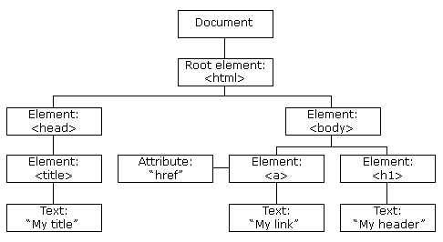
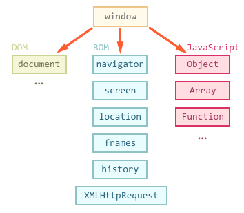

Let's go back to the basics and briefly review two important JavaScript concepts: the DOM and the BOM.


## DOM

The **Document Object Model** (DOM) is a set of utilities for manipulating XML documents (and, by extension, also HTML documents, which is
what we are most likely interested in).

Before being able to make use of these utilities and helpers, DOM transforms XML files into a **tree structure**, that is, a hierarchy of
nodes. This tree **represents both the content of the document and the relationship between the nodes**.



### Node types

Note how in the example above we've got different node types: most of them are labelled as `Element`, but others are marked as `Attribute`
or `Text` instead. The DOM defines different types of nodes which implement different interfaces. Here's a list of the most common node
types:

- `Document` which is the root node of all XML (HTML) documents.
- `DocumentType` which represents the document type definition (DTD) used on the page (`doctype` tag)
- `Element` which represents a tag
- `Attr` which is a key-value pair representing an attribute for a tag.
- `Text` which represents the content of a node.
- `Comment` which represents XML/HTML comments.

### The `Node` interface

A `Node` object implements and exposes the following properties and methods. You can find a thorough list
[on MDN](https://developer.mozilla.org/en-US/docs/Web/API/Node).

- `nodeName`
- `nodeValue`
- `nodeType`
- `ownerDocument`
- `firstChild`
- `lastChild`
- `childNodes`
- `previousSibling`
- `nextSibling`
- `hasChildNodes()`
- `attributes`
- `parentNode`
- `parentElement`
- `appendChild(node)`
- `removeChild(node)`
- `replaceChild(newNode, previousNode)`
- `insertBefore(newNode, previousNode)`

### Accessing nodes

The easiest way to get hold of nodes is by referencing them directly using one of the following methods:

- `document.querySelector(selector): Element` where selector is something in the lines of `#some-id`, `.some-classname`, or `tag`. If there
  are multiple elements matching the selector, you'll only get the first one returned.
- `document.querySelectorAll(selector): NodeList`
- `document.getElementById(id: string): Element`
- `document.getElementsByClassName(classname: string): HTMLCollection`
- `document.getElementsByTagName(tag: string): HTMLCollection`
- `document.getElementsByName(name: string): NodeList`

We can also use most of these methods (except `getElementById` and `getElementByName`) on any node of type `Element` which acts as the root
element for our query:

```js
const wrapper = document.querySelector('#wrapper');

wrapper.getElementsByTagName('p');
wrapper.getElementsByClassName('active');
wrapper.getElementsByName('something');
```

See how some methods return a [`NodeList`](https://developer.mozilla.org/en-US/docs/Web/API/NodeList) whereas others return a
[`HTMLCollection`](https://developer.mozilla.org/en-US/docs/Web/API/HTMLCollection)? An `HTMLCollection` is always **live**, which means
that changes to the DOM are reflected in the collection. A `NodeList`, on the other hand, can be either **live** or **static**.
`document.querySelectorAll` returns a static `NodeList`, meaning any subsequent changes to the DOM won't be reflected in the collection (ie:
the static `NodeList` object).

A note on performance: In some browsers there are significant performance costs for using `querySelectorAll` instead of, for instance,
`getElementsByTagName`. This is because a static `NodeList` needs to have all the necessary data upfront, whereas a live `NodeList` can be
generated and returned much quickly.

Moving on... We can also make use of most of the properties of the `Node` interface to traverse the `document` object by specifying the path
all the way down to the node we are trying to grab. For instance:

```js
document.documentElement.lastChild;
document.documentElement.childNodes[0];
document.documentElement.firstChild.nextSibling;
document.body.previousSibling;
document.body.parentNode;
```

Side note: in most cases, `parentNode` and `parentElement` return the same thing. They only differ when the parent node is not of type
`Element`, in which case `parentElement` will return `null`. For instance:

```js
// both return the html element
document.body.parentNode === document.body.parentElement; // true

document.documentElement.parentNode; // returns the document node
document.documentElement.parentElement; // returns null
```

Another quick aside, this time on the difference between `document` and `document.documentElement`. The latter returns the `html` element,
which is most likely what you are after if you are trying to traverse the DOM. Also, they have different node types assigned:

```js
document.nodeType; // 9 = DOCUMENT_NODE
document.documentElement.nodeType; // 1 = ELEMENT_NODE
```

### Attributes

DOM nodes of type `Element` expose an `attributes` property of type `NamedNodeMap` which is a collection of all attributes for a particular
element.

```js
const element = document.querySelector('#title');
const className = element.attributes.class; // dot notation
const firstAttribute = element.attributes[0]; // array notation
```

Note that any element within the `attributes` collection is an object of type `Node` for which `nodeType = 2`, ie: `ATTRIBUTE_NODE`.

```js
element.attributes.class.nodeType; // returns 2 = ATTRIBUTE_NODE
```

We can get, set and remove attributes by using these methods:

- `element.getAttribute('class')`
- `element.setAttribute('class', 'new-classname')`
- `element.setAttributeNode(attributeNode)`
- `element.removeAttribute('class')`

The DOM HTML specification allows **accessing and modifying all attributes directly** by assigning new values:

```html

```

```js
const image = document.querySelector('.logo');

image.src; // returns "image.jpg"
image.alt = 'Rawr'; // updates the alt text
```

This holds true for all attributes except for `class` . This is because `class` is a reserved keyword put into use as of ES6. That's why we
need to use the alternative attribute name `className` instead. The same principle applies to the `for` attribute in the label element,
where we use `htmlFor` instead.

```js
image.className; // returns "logo logo-sm"
image.class; // returns undefined
```

Note that for CSS classes we have also got access to the `classList` property which is a collection of type `DOMTokenList` that lists all of
the element classnames. This interface implements four important methods: `add`, `remove`, `toggle` and `contains`.

```js
image.classList; // returns ["logo", "logo-sm"]image.classList.add('logo-awesome');

image.classList.remove('logo-sm');
image.classList.toggle('active');
image.classList.contains('this-class-doesnt-exist');

image.classList; // now returns ["logo", "logo-awesome", "active"]
```

One more thing, this time about listing all computed CSS properties of an element. There's a method called
`window.getComputedStyles(element)` you pass in your element to and returns a massive object of type `CSSStyleDeclaration` you can use to
figure out the computed styles of an element, no matter how they got applied.

```js
getComputedStyle(image).width; // returns the actual image width
```

### Creating, removing and replacing Nodes

There are different factory methods attached to the document object we can use to create nodes of different types. Most common ones are:

- `document.createElement(tag: string)`: returns a node of type [`Element`](https://developer.mozilla.org/en-US/docs/Web/API/Element)
- `document.createAttribute(name: string)`: returns a node of type [`Attr`](https://developer.mozilla.org/en-US/docs/Web/API/Attr)
- `document.createTextNode(text: string)`: returns a node of type [`Text`](https://developer.mozilla.org/en-US/docs/Web/API/Text)
- `document.createComment(comment: string)`: returns a node of type [`Comment`](https://developer.mozilla.org/en-US/docs/Web/API/Comment)

Some examples:

```js
const p = document.createElement('p');
const blurb = document.createTextNode('sup mate');
const attr = document.createAttributeNode('class');

p.appendChild(blurb);
attr.value = 'my-custom-class';
p.setAttributeNode(attr);
p.setAttribute('is-awesome', true);
```

To **remove nodes**, use the `removeChild` method by querying the parent first. `removeChild` takes the element we are trying to remove as a
param.

There's also the `remove` method we can use on elements, although it's not supported on Internet Explorer and needs to be polyfilled.

```js
const element = document.querySelector('#title');

element.parentNode.removeChild(element);
element.remove(); // this doesn't work on IE!
```

We can **replace a node** via the `replaceChild` method. It's kind of the same process we'd use to remove a node: we query the parent node
first, then we call the `replaceChild` method on the parent passing in the `newElement` first and the `oldElement` (the one we are trying to
replace) as the second param, and we end up getting the replaced node back.

```js
const oldElement = document.querySelector('#title');
const newElement = document.createTextNode('this is our new title');
const newElementText = document.createTextNode('our new title');

newElement.appendChild(newElementText);

const replacedNode = oldElement.parentNode.replaceChild(newElement, oldElement);

replacedNode === oldElement; // true
```

### Node relationships

There are a bunch of ways for setting a relationship between two nodes:

- `element.append`
- `element.appendChild`
- `element.insertBefore`
- `element.insertAdjacentElement`

### Events

Each HTML element has its own list of supported **events types**. We **listen for events** on an element, and whenever the event is
triggered we handle it through a function called **event handler**.

- One element can listen and respond to multiple event types.
- One event type can be handled by multiple elements.

You can bind event handlers to elements via the `addEventListener` method. First argument is the event name, second one is the event
handler:

```js
const button = document.querySelector('#button');

function handleClick(event) {
    console.log('clicked');
}

button.addEventListener('click', handleClick);
```

Our event handler function receives an `event` object passed in as a param.

To stop listening for an event on an particular element, use the
[`removeEventListener`](https://developer.mozilla.org/en-US/docs/Web/API/EventTarget/removeEventListener) method on it:

```js
button.removeEventListener('click', handleClick);
```

There's a catch, though. To remove event handlers, the handler function needs to be a named function, you need to keep a reference to the
function handling the event. In other words, this means **anonymous functions won't work if you are planning on removing the listener later
on**.

Here's a list with some of the most widely used event types:

- Mouse events: `click`, `dblclick`, `mousedown`, `mouseout`, `mouseover`, `mouseup`, `mousemove`.
- Keyboard events: `keydown`, `keypress`, `keyup`.
- HTML events: `load`, `unload`, `abort`, `error`, `resize`, `change`, `submit`, `reset`, `scroll`, `focus`, `blur`.
- DOM events: `DOMSubtreeModified`, `DOMNodeInserted`, `DOMNodeRemoved`.

For a more extensive list of event types check out [this link](https://developer.mozilla.org/en-US/docs/Web/Events).

## BOM

The **Browser Object Model** (BOM) allows JavaScript to _talk_ to the browser about matters other than the content of the page.

There are no official standards for the BOM, albeit browser vendors have implemented almost the same features for interoperability.



### The `window` object

The `window` object is the very root element, everything else is attached to it either directly or indirectly. Hence there's no need to
reference it explicitly.

In tabbed browsers, each tab owns its own `window` object, ie: it is not shared between tabs in the same window.

Also, all of the variables and functions that don't get attached to any other object, get attached to the `window` object and are then
within the global scope. In other words: **global variables become properties of the window object, whereas global functions become methods
of the window object**.

The `window` global object provides access to:

- properties which provide info on the browser's window:

```js
// outer dimensions
const outerHeight = window.outerHeight;
const outerWidth = window.outerWidth;

// inner dimensions
const innerHeight = window.innerHeight;
const innerWidth = window.innerWidth;
```

- methods for setting timers and to repeatedly call a function:

```js
const timeout = setTimeout(callback, delay); // delay in ms
const interval = setInterval(callback, delay); // delay in ms

clearTimeout(timeout);
clearInterval(interval);
```

And many more. [Here's a full list](https://developer.mozilla.org/en-US/docs/Web/API/Window) of all of the properties and methods of the
global `window` object.

### The `location` object

Because of the lack of an standard, we've got the `location` object attached to both `document` and `window`:

```js
document.location === window.location; // returns true
```

This objects allows for reading and manipulating the URL on the browser's address bar. Here's a list of all of the major properties and
methods it exposes (a more extensive list can be found [here](https://developer.mozilla.org/en-US/docs/Web/API/Location)):

- `location.hash`
- `location.host`
- `location.hostname`
- `location.href` returns the full URL of the current page. We can also write to this property, causing a redirect to the new value.
- `location.pathname` returns whatever comes after the hostname.
- `location.port` returns the port number but only if it's set on the URL.
- `location.protocol` returns the protocol used to access the page.
- `location.search` returns whatever comes after the `?` in the URL.
- `location.assign(url)` navigates to the url passed in as a param.
- `location.replace(url)` is similar to assign, but the replaced site gets removed from the session history.
- `location.reload()` which has the same effect as clicking the reload button on our browser.

More info on the `Location` interface on [MDN](https://developer.mozilla.org/en-US/docs/Web/API/Location).

### The `history` object

`window.history` allows to manipulate the browser **session history**, that is the pages visited in the tab or frame that the current page
is loaded in.

- `history.length` returns an integer representing the number of elements in the session history, including the currently loaded page.
- `history.go(integer)` redirects to the page in the session history identified by its **relative** location to the current page.
- `history.back(integer)` redirects to the previous page in the session history, same as clicking the browser's Back button.
- `history.forward(integer)` redirects to the next page in the session history, same as clicking the browser's Forward button.

More info on the `History` interface [here](https://developer.mozilla.org/en-US/docs/Web/API/History).

### The `navigator` object

`window.navigator` provides info on the state and identity of the **user agent** or UA (that is, the browser and OS the user is running).

- `navigator.userAgent` returns the user agent for the current browser.
- `navigator.language` returns a string representing the preferred language of the user, usually the language of the browser UI.
- `navigator.languages` returns an array of the languages known to the user, sorted by preference: `["en-GB", "en-US", "en"]`
- `navigator.getBattery()` returns a promise which is resolved into a `BatteryManager` object providing not only information about the
  system's battery but also some events you can handle to monitor the battery status.
- `navigator.plugins` returns a list of the plugins installed in the browser.
- `navigator.onLine` returns a boolean indicating whether the browser is working online.
- `navigator.geolocation` returns a `Geolocation` object allowing accessing the location of the device.

There are also some other properties available we can't always rely on:

- `navigator.appName` should return the browser's name.
- `navigator.appVersion` should return the browser's version number.
- `navigator.plaftorm` should return the browser's platform name.

That wraps it up for this DOM and BOM high-level overview. Please refer to the MDN site for further and more detailed content. Thanks for
reading!
