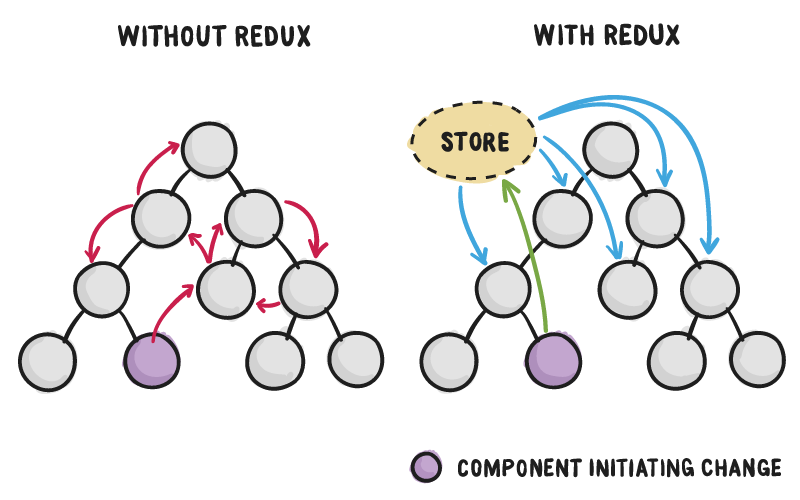
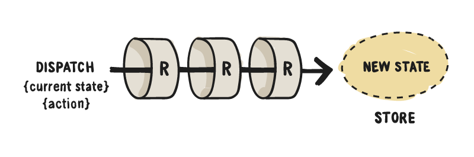

This article is not about explaining how to bring Redux into your own React application, there are heaps of tutorials touching on that
already. Let's rather try to understand what's really going on under the hood when we use Redux by implementing a simplified version of it
from scratch.

## TL;DR

Don't feel like reading the whole thing? You can find the code for this article [here](https://github.com/fed/redux-from-scratch). The
`src/lib` folder holds a rough re-implementation of both the `redux` and `react-redux` libraries.

## The need for Redux

Have you ever needed to display a loading spinner in your application, and found yourself passing in a callback two or three levels down
your component hierarchy to have the spinner displayed when appropriate?

Communicating React components is fairly straightforward when we've got a parent-child relationship, but can quickly get messy if we are
trying to communicate components within different levels down the tree hierarchy.

> For communication between two components that don't have a parent-child relationship, you can set up your own global event system.
> Subscribe to events in `componentDidMount()`, unsubscribe in `componentWillUnmount()`, and call `setState()` when you receive an event.
> The [Flux](https://facebook.github.io/flux/) pattern is one of the possible ways to arrange this. — React docs

This is what Redux is for. Whenever Redux is involved, **container components** don't communicate directly between each other by passing in
callbacks and props down the tree.

This is the rough flow proposed by Redux:

1. **Components** are given callback functions as props, which they call whenever a **UI event** happens.
2. Those callbacks **create and dispatch actions** based on the event.
3. **Reducers** process the actions, computing the new state.
4. The new **state** of the whole application goes into a **single store**.
5. **Components** receive the new state as props and **re-render themselves _where needed_**.



## State Tree

- Redux is a (predictable) state container for our application, and the state tree is the **minimum representation of our application
  state** at any given time.
- There is **only one state tree** that holds the state for the whole application. This means there's a **single source of truth** for our
  data/state.
- The state tree lives within the application store. More on this later.
- The state tree is **read only**, meaning we cannot modify or write to it **directly**. The only way to change it is by dispatching
  actions.

## Actions

An action is a **plain JavaScript object** that describes in a minimal way _what_ needs to get updated in the application state. Actions are
**a way to trigger state mutations**: they describe what should change, albeit having no idea how to make that change.

Whether it is initiated by a network request or by user interaction via the UI layer, any data that gets into the Redux store gets there
through an action. This means an action can be trigged in response to some user interaction (_e.g._: click on a button) but also by the
completion or failure of some asynchronous operation, such as a network call.

Actions are identified by a string called **action type**. This identifier is mandatory, and naturally it's required to be unique. Action
types are strings because they need to be serialisable.

Actions can optionally carry some sort of **payload** or data required by the corresponding _reducer_ to successfully mutate the state.

```js
function displayAlert() {
    return {
        type: 'DISPLAY_ALERT',
        payload: {
            message: 'Something went wrong',
        },
    };
}
```

By the way, this particular example follows the [Flux Standard Action](https://github.com/acdlite/flux-standard-action) pattern. This is of
course optional but I found it to be a nice way to describe your actions keeping them consistent throughout the application.

## Reducers

Reducers are **pure functions which describe state mutations**. Unlike actions, reducers do know how to have things changed in the
application state, **they do know the implementation details for those changes**.

The **signature for a reducer function** is as follows:

```js
function someReducer(previousState, action) {
    return nextState;
}
```

where `state` is the current application state, `action` is the action object which has triggered the state mutation (containing an action
type and any relevant payload) and `nextState` is the resulting computed state of the app which can be derived from the other two arguments.

## Store

The store is the glue that holds all of the Redux building blocks together: the state tree, the action dispatcher and the application
reducers. And as such, there can only be a **single instance** of the store in a Redux app.

Once instantiated, the `store` exposes three important methods:

### `store.getState()`

The store holds the state object (_aka_: **state tree**). This `getState` method retrieves and returns the current state of the Redux store
(that is, the current state tree). If we haven't triggered any action yet, `getState` will return the initial state of our application.

```js
console.log(store.getState()); // returns the state tree
```

### `store.dispatch(action)`

The application store allows us to trigger actions in order to have the state of our application changed by exposing a `dispatch` method. We
only need to pass in a valid action object to it, and the store will take care of the rest.

```js
store.dispatch({ type: 'SHOW_SPINNER' });
```

### `store.subscribe(callback)`

The store also keeps track of all of those who have subscribed to changes in the state tree. The `subscribe` method allows us to register a
**callback** that will be run any time an action is dispatched causing the state tree to update. In Reactland (or any other declarative UI
library) we can leverage this to trigger a re-render of our view layer.

Note that the `subscribe` method returns an `unsubscribe` function we can call later on to have ourselves removed from the list of
listeners. Calling this `unsubscribe` function means we will no longer be notified when something changes in the state tree (_i.e._: we
_stop observing_ the Redux store).

```js
const unsubscribe = store.subscribe(callback);
unsubscribe();
```

Only those components that need to be aware of state changes should subscribe to the store, and that's why we usually make a distinction
between **presentational and container components**. More on this later.

## Implementing `createStore` from scratch

Redux is shipped with a `createStore` method we need to use in order to instantiate our application store.

```js
const store = createStore(rootReducer);
```

The first argument it takes is a reducer (a single one) that describes how the global state gets updated for each particular action. We call
this top-level reducer or **root reducer**.

_Spoiler_: even though `rootReducer` is a single reducer function, we can still combine multiple reducers into a single one. More on this
later.

This is a rough implementation of `createStore`:

```js
function createStore(reducer) {
    let state;
    let listeners = [];

    const getState = () => state;

    const dispatch = (action) => {
        state = reducer(state, action);
        listeners.forEach((listener) => listener());
    };

    const subscribe = (listener) => {
        listeners.push(listener);

        return () => {
            listeners = listeners.filter((l) => l !== listener);
        };
    };

    dispatch({ type: '@@redux/INIT' });

    return {
        getState,
        dispatch,
        subscribe,
    };
}
```

Let's briefly go through what's going on here:

- **we've got two private variables:** `state` which holds our state tree, and `listeners` which is an array that keeps track of all of the
  callbacks we need to run when our state tree changes.
- **we've got three functions which we expose:** first one is `getState()` which returns the current state tree; second one is
  `dispatch(action)` which allows us to trigger actions in order to update the application state; and finally `subscribe(callback)` which
  allows us to register observers who will get notified whenever the state tree changes.
- **we dispatch an `init` action**: when a store is created, an initialisation action is dispatched in order to have the state tree
  populated with the initial values set on each of our reducers. The `@@redux` prefix indicates system actions triggered by Redux itself.

## Reducer composition pattern

Right now our `rootReducer` looks something like this:

```js
const initialState = {
    count: 0,
    alert: {
        visible: false,
        message: '',
    },
};

function rootReducer(state = initialState, action) {
    switch (action) {
        case 'COUNTER/INCREMENT':
            return Object.assign({}, state, { count: state.count + 1 });
        case 'COUNTER/DECREMENT':
            return Object.assign({}, state, { count: state.count - 1 });
        case 'ALERT/SHOW':
            return Object.assign({}, state, {
                alert: { visible: true, message: action.payload.message },
            });
        case 'ALERT/HIDE':
            return Object.assign({}, state, {
                alert: { visible: false, message: '' },
            });
        default:
            return state;
    }
}
```

It handles all possible actions into a single place. This might work just fine if you only have a bunch of actions, but it's certainly not
scalable.

Reducer composition means that **a reducer can call or be called by another reducer**. This is useful as it allows us to move from a single,
gigantic reducer handling all possible (unrelated) actions to a set of specialised, independent reducers focusing on a single part of our
application state.

As a result, our top level reducer will be made out of a bunch of other smaller reducers. Note that **there is still a single top level
reducer managing the state of your app**, we just broke it down into smaller chunks. When we instantiate our store using `createStore`,
however, we need to pass in a single reducer as a param.

Here's an example of what we mean by using the **reducer composition pattern** to delegate managing different parts of the state tree to
other reducers.

```js
const rootReducer = (state, action) => ({
    count: counterReducer(state.counter, action),
    alert: alertReducer(state.alert, action),
});
```

Some important things to note here:

1. The first time this runs, `state.counter` and `state.alert` will both be `undefined`. This means reducers will end up returning their
   corresponding **initial value**, thus populating the store for the first time.
2. The object returned by `rootReducer` **shapes our state tree**. In this case, it will be an object having two properties: `counter` and
   `alert`. The shape of the state tree is up to you: it can be a primitive, an array, an object, an
   [Immutable.js](https://facebook.github.io/immutable-js/) structure, anything.
3. When an action comes in, **all of our specialised reducers get called every single time**... **all of them!** Only those reducers knowing
   how to handle this action will return an updated model, while the rest will return their current state. This is why it's important for
   all reducers to return their current state as the default case. The image below illustrates this fact:



## A built-in reducer composition solution

The `combineReducers` helper gets shipped with Redux. It only takes one argument: an object. This object lets us configure the mapping
between the state tree field names, and the reducers managing them.

```js
import { combineReducers } from 'redux';
import { counter, alert } from './reducers';

const rootReducer = combineReducers({
    count: counter,
    alert,
});
```

This `combineReducer` call translates to: _"our state tree consists of two different properties, `count` and `alert`, which will be handled
by the `counter` and `alert` reducers respectively"_.

Let's now rewrite `combineReducers` from scratch. `combineReducers` is a function whose only argument is the mapping between the state keys
and the reducers. The returned value is supposed to be a reducer itself, therefore its signature must match the reducer signature:
`f(state, action)`.

Here's what a rough implementation of `combineReducers`:

```js
const combineReducers = (reducers) => {
    return (state = {}, action) => {
        return Object.keys(reducers).reduce((nextState, key) => {
            nextState[key] = reducers[key](state[key], action);
            return nextState;
        }, {});
    };
};
```

Again, some things worth noting here:

1. We calculate the next state for any given key by calling the corresponding reducer. _See how **all** reducers always run whenever an
   action gets triggered?_
2. If you have a look at the second parameter of the `reduce` method, `nestState` starts off being an empty object and we gradually attach
   properties to it when running `nextState[key] = ...`.
3. Finally, we are mutating the `nextState` object on each iteration. This is not a problem though, because we are mutating an object we
   have created ourselves inside the reducer, it isn't something we got passed in from the outside, meaning it's still a pure function.

## Presentational vs Container Components

We have been talking about presentational and container components. Here's a brief description of what we mean when talking about those.

### Presentational components:

- Are concerned with how things look.
- Also referred to as “dumb components” as they only display data.
- Usually have DOM markup and styles of their own.
- Have no dependencies on the rest of the app, such as Redux actions or stores.
- Don't specify how data is loaded or mutated.
- Receive data and callbacks exclusively via props.
- Rarely have state of their own, and when they do it's just UI state rather than actual data, for instance something like “the menu is
  collapsed or expanded” for an accordion component.
- Can be written as **functional components** unless they need state, lifecycle hooks, access to `ref` or performance optimisations.
- May contain both presentational and container components that can be rendered via `this.props.children`.

### Container Components:

- Are mostly concerned with how things work.
- Also referred to as “smart components” as they can trigger state mutations by dispatching actions.
- Don't usually have much DOM markup/styles of their own except for a few wrapping divs.
- Provide data and behaviour (callbacks) to presentational components.
- Are often stateful, as they tend to serve as data sources.
- Can contain both presentational and container components.

Now, **when should we introduce new containers?** As a rule of thumb, start building your app exclusively with presentational components.
Eventually you'll realise that you are passing down too many props through intermediate components. When you notice that there are
components which don't use the props they receive and rather forward them to their children, and when you have to rewire all those
intermediate/bridging components any time some child needs more data, that's a clear indicator you might be needing to introduce a container
component. This way you can **get the data and the behaviour props to the leaf components without burdening the unrelated components in the
middle of the tree**.

## Connecting container components to the store

Possibly the simplest way to have a component access the store to read the state tree, trigger actions and subscribe to state changes is to
directly reference it, something in the lines of:

```js
import { getState, dispatch, subscribe } from './store';

class Counter extends React.Component {
    componentDidMount() {
        this.unsubscribe = subscribe(this.forceUpdate);
    }

    componentWillUnmount() {
        this.unsubscribe();
    }

    render() {
        return (
            <div>
                <p>{getState().count}</p>
                <button onClick={() => dispatch({ type: 'INCREMENT' })}>Increment counter</button>
            </div>
        );
    }
}
```

This is not maintainable for two main reasons:

1. **Testing:** this approach prevents us from providing mock store instances.
2. **Server-side Rendering (SSR):** when building universal (isomorphic) applications we need to provide a different store instance for
   every request because different requests involve different data.

An alternative solution would be to pass the store down from the root component:

```js
ReactDOM.render(<App store={store} />, document.querySelector('#root'));
```

making our `Counter` component look like this:

```js
class Counter extends React.Component {
    componentDidMount() {
        const { subscribe } = this.props.store;

        this.unsubscribe = subscribe(this.forceUpdate);
    }

    componentWillUnmount() {
        this.unsubscribe();
    }

    render() {
        const { getState, dispatch } = this.props.store;

        return (
            <div>
                <p>{getState().count}</p>
                <button onClick={() => dispatch({ type: 'INCREMENT' })}>Increment counter</button>
            </div>
        );
    }
}
```

This works just fine for shallow component trees. However, if all of our components need to pass down the `store` to their children, this
quickly gets messy and complex. We can do better!

## Introducing `react-redux`

Since connecting container components to the store is a recurrent problem every React+Redux app faces, the Redux authors came up with some
sort of standard solution. They worked on a package called [react-redux](https://github.com/reactjs/react-redux) which provides a handful of
React bindings for Redux. This means this library provides all of the tools we need to integrate our React app with Redux, particularly
these two:

- `<Provider>`, a React component
- `connect`, a higher-order React component (HOC)

Just a side note about why we need two different projects, instead of having these live within the Redux package. Even though Redux was
built with React in mind, it's actually a view-layer agnostic state management solution. People are using Redux with
[Angular](https://github.com/angular-redux/ng-redux) or [Vue](https://github.com/revue/revue). Hence it makes sense for these tools to live
outside of the Redux project.

## Using `Provider` to pass the store down to all children components

The `react-redux` library provides a `<Provider>` component whose job is to pass down the store to all of the **connected** components **no
matter how deep they are** down the component tree.

This way we don't need to pass the `store` as a prop to our children: `Provider` does this for us automagically… well, sort of. It actually
makes use of React's `context` feature:

> By adding childContextTypes and getChildContext to the context provider, React passes the information down automatically and **any
> component** in the subtree can access it by defining contextTypes. If contextTypes is not defined, then context will be an empty object. —
> [React docs](https://facebook.github.io/react/docs/context.html)

This all means, instead of be passing down the store **explicitly via props**, we'll be passing it in **implicitly via context**.

Note that `context` works even on stateless components.

This is what an implementation of `Provider` would look like. It's indeed a pretty simple component.

```js
export class Provider extends React.Component {
    getChildContext() {
        return {
            store: this.props.store,
        };
    }

    render() {
        return this.props.children;
    }
}

Provider.childContextTypes = {
    store: React.PropTypes.object.isRequired,
};
```

The object returned by `getChildContext` defines what **all children components (no matter how deep they are down the tree)** will get via
`context`. In this case, the only property we are sending over is the `store`.

There's a condition for this to work, though. In React, the context is opt-in, meaning you need to somehow subscribe to it in order to gain
access. This is how you do it:

```js
class ChildComponent extends React.Component { ... }

ChildComponent.contextTypes = {
  store: React.PropTypes.object.isRequired
};
```

## Generating container components with `connect`

The purpose of `connect` is to return a container component which is connected to the store: it injects **part of the Redux state** and
**also actions** into our components **as props**, and it's also part of the `react-redux` library.

`connect` is a **curried function**: its first application returns a HOC (higher-order component). When we pass in our own component to this
HOC, we are gonna have it turned into a container component connected to the Redux store.

Here's a rough, _simplified_ implementation of `connect`:

```js
export function connect(mapStateToProps, mapDispatchToProps) {
    return function (WrappedComponent) {
        class ConnectedWrappedComponent extends React.Component {
            componentDidMount() {
                const { subscribe } = this.context.store;
                this.unsubscribe = subscribe(this.handleChange.bind(this));
            }

            componentWillUnmount() {
                this.unsubscribe();
            }

            handleChange() {
                this.forceUpdate();
            }

            render() {
                const { getState, dispatch } = this.context.store;

                return (
                    <WrappedComponent
                        {...this.props}
                        {...mapStateToProps(getState(), this.props)}
                        {...mapDispatchToProps(dispatch, this.props)}
                    />
                );
            }
        }

        ConnectedWrappedComponent.contextTypes = {
            store: React.PropTypes.object.isRequired,
        };

        return ConnectedWrappedComponent;
    };
}
```

Some notes on this implementation:

- `this.forceUpdate()` makes the component re-render itself whenever the state tree changes. As noted
  [here on the React docs](https://facebook.github.io/react/docs/react-component.html#forceupdate), `forceUpdate` is a (_discouraged_) way
  to manually trigger the `render` method on a component.
- We're well aware that the store's `subscribe` method returns an unsubscribe function. Here we are subscribing to the store changes on
  `componentDidMount` and unregistering our component from the list of listeners whenever the component gets unmounted (that is, within the
  `componentWillUnmount` lifecycle method).
- The HOC renders our component with its own props _plus_ all of the additional props calculated from the Redux store: data and callbacks.

## `mapStateToProps` and `mapDispatchToProps`

`connect` returns a container component whose props will be the result of merging the objects returned from `mapStateToProps` and
`mapDispatchToProps` together with its own props.

- `mapStateToProps` is a function that receives `store.getState()` (that is, the global state) as a param and returns a configuration object
  used to map the Redux state tree into props our component will receive. The main idea behind `mapStateToProps` is to **isolate which parts
  of the overall state this component needs**.
- `mapDispatchToProps` is also a function that receives `store.dispatch` as an argument and returns a configuration object used to determine
  which callback prop dispatches which Redux action.

Here's a simple example to make sense of these two functions:

```js
function mapStateToProps(state) {
  return {
    count: state.counter
  };
}

function mapDispatchToProps(dispatch) {
  return {
    increment: dispatch({ type: 'INCREMENT' }),
    decrement: dispatch({ type: 'DECREMENT' })
  };
}

export connect(mapStateToProps, mapDispatchToProps)(Counter);
```

This means our container component will have access to:

- `this.props.count`
- `this.props.increment()`
- `this.props.decrement()`

along with its other own props.

By the way, both the `mapStateToProps` and `matchDispatchToProps` receive `ownProps` as their second argument, enabling you to do some sort
of computation involving the Redux global state and your component's own props:

```js
function mapStateToProps(state, ownProps) { ... }
function mapDispatchToProps(dispatch, ownProps) { ... }
```

## Using `connect` to generate a container component which is not connected to the store

By passing in `null` as `mapStateToProps` we are telling `connect` not to subscribe to the store as we don't need access to the global state
tree and therefore it's pointless and wasteful for us to get notified whenever the store updates.

```js
const mapDispatchToProps = (dispatch) => ({ dispatch });
export default connect(null, mapDispatchToProps)(Counter);
```

In this example we are only passing in `mapDispatchToProps` as we might need to be able to dispatch actions from within our component.
However, and since this is such a common pattern, the `react-redux` authors realised it would be nice to agree on this convention: if we do
not pass in any params whatsoever to the `connect` function, it will result into a container component which is not subscribed to the store
(_i.e._: it won't re-render whenever the state tree changes) albeit receiving `store.dispatch` as a prop.

```js
export default connect()(Counter);
```

This means the component will know how to trigger Redux actions using `this.props.dispatch({ type: INCREMENT })`. Note how this chunk of
code is completely equivalent to the previous one.

## Extracting action creators

There's one more thing we can do to make our containers look prettier. Instead of using `this.props.dispatch` within our components, we can
resort to action creators to dispatch actions from the view layer.

**Action creators are nothing other than functions returning an object.** We still need to have access to `store.dispatch` in order to
successfully dispatch those actions. We do this in `mapDispatchToProps` and action creators become part of `this.props`.

```js
function mapDispatchToProps(dispatch) {
    return {
        increment: () => dispatch(increment()),
        decrement: () => dispatch(decrement()),
    };
}
```

where `increment` and `decrement` can live within another file, and are defined as follows:

```js
export const increment = () => ({
    type: 'COUNTER/INCREMENT',
});

export const decrement = () => ({
    type: 'COUNTER/DECREMENT',
});
```

We now have access to `this.props.increment` from within our component:

```js
<button onClick={this.props.increment}>Increment</button>
```

which is indeed way more convenient than doing:

```js
<button onClick={this.props.dispatch({ type: 'INCREMENT' })}>Increment</button>
```

This allows for abstracting our components from action definitions.

_Side note:_ read about [`bindActionCreators`](http://redux.js.org/docs/api/bindActionCreators.html) for an even better way to achieve this.

## Credits

This post is heavily inspired by Dan Abramov's [Egghead course](https://egghead.io/courses/getting-started-with-redux). I've also borrowed a
couple images from this [CSS Tricks post](https://css-tricks.com/learning-react-redux/) by Brad Westfall.
