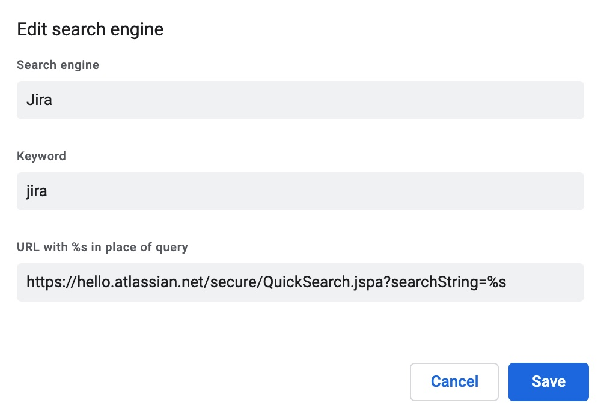

Here's how you can add the ability to search and directly access Jira tickets from within your browser's URL bar.

Go to **Settings > Search Engines > Manage Search Engines** and add a new engine with the details below:

Save the changes and in your omnibox, type in `jira` and press tab, then enter a ticket name and after hitting enter you should be
redirected there.

Also, since we are using Jira's search URL, we can search for tickets via keywords if you don't remember the ticket number.
